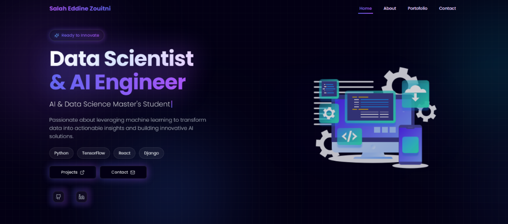
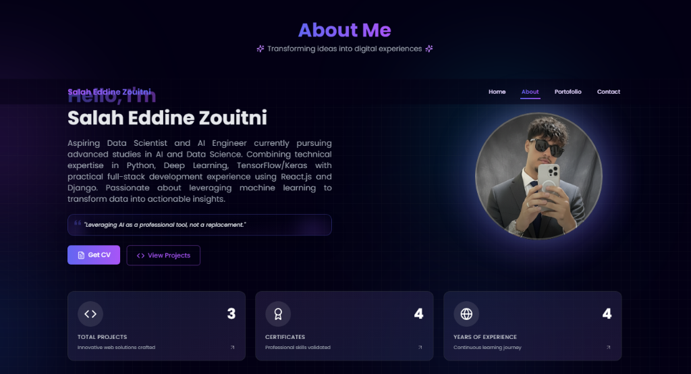
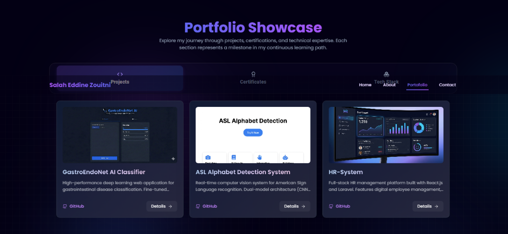
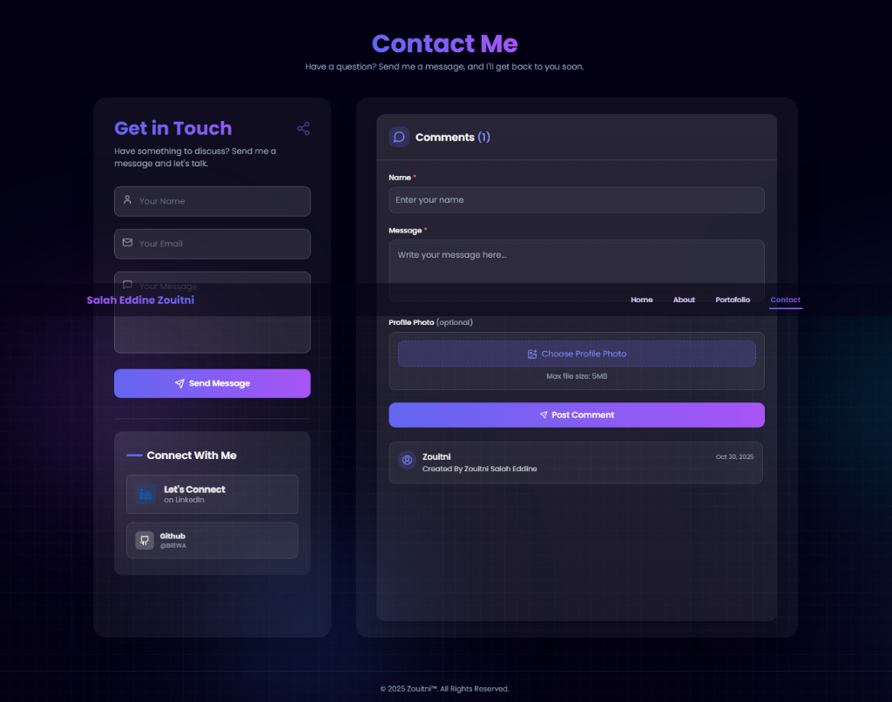

# 🚀 Personal Portfolio

A modern, responsive portfolio website built with React.js and Vite, featuring stunning animations, 3D elements, and a sleek dark theme design.



## ✨ Features

- **Modern UI/UX** - Glassmorphism design with smooth animations
- **Responsive Design** - Fully optimized for all devices
- **3D Elements** - Interactive Spline 3D components
- **Dynamic Animations** - Powered by Framer Motion, GSAP, and AOS
- **Tab Navigation** - Swipeable views for Projects, Certificates, and Tech Stack
- **PDF Certificate Support** - View certificates directly in browser
- **Contact Form** - Integrated with backend for messages

## 📸 Screenshots

### Home Section


### About Section


### Portfolio Section


### Contact Section


## 🛠️ Tech Stack

| Category | Technologies |
|----------|-------------|
| **Frontend** | React.js, Vite |
| **Styling** | Tailwind CSS, Material UI, Styled Components |
| **Animations** | Framer Motion, GSAP, AOS |
| **3D Graphics** | Spline |
| **UI Components** | Headless UI, Lucide Icons |
| **Backend** | Supabase, Firebase |

## 🚀 Getting Started

### Prerequisites

- Node.js (v18 or higher)
- npm or yarn

### Installation

1. **Clone the repository**
   ```bash
   git clone https://github.com/yourusername/portfolio.git
   cd portfolio
   ```

2. **Install dependencies**
   ```bash
   npm install
   ```

3. **Run development server**
   ```bash
   npm run dev
   ```

4. **Build for production**
   ```bash
   npm run build
   ```

## 📁 Project Structure

```
├── public/
│   ├── certificates/     # PDF certificates
│   ├── TechStack/        # Tech stack icons
│   └── ...
├── src/
│   ├── components/       # Reusable components
│   │   ├── Navbar.jsx
│   │   ├── Certificate.jsx
│   │   ├── CardProject.jsx
│   │   └── ...
│   ├── Pages/            # Main page sections
│   │   ├── Home.jsx
│   │   ├── About.jsx
│   │   ├── Portofolio.jsx
│   │   └── Contact.jsx
│   └── App.jsx
├── screenshots/          # Project screenshots
└── package.json
```

## 📄 Sections

1. **Home** - Welcome screen with 3D robot animation and introduction
2. **About** - Personal info, skills, and statistics
3. **Portfolio** - Showcasing projects, certificates, and tech stack
4. **Contact** - Contact form and social links

## 🎓 Education

- 🎯 **Master in AI and Data Science** - *In Progress (2nd Year)*
- 📜 Licence in Software and Web Development
- 📜 BTS in Web Conception and Multimedia
- 📜 Baccalauréat in Physical Sciences

## 📝 License

This project is open source and available under the [MIT License](LICENSE).

## 📧 Contact

Feel free to reach out for collaborations or inquiries!

---

<p align="center">Made with ❤️ using React & Vite</p>
